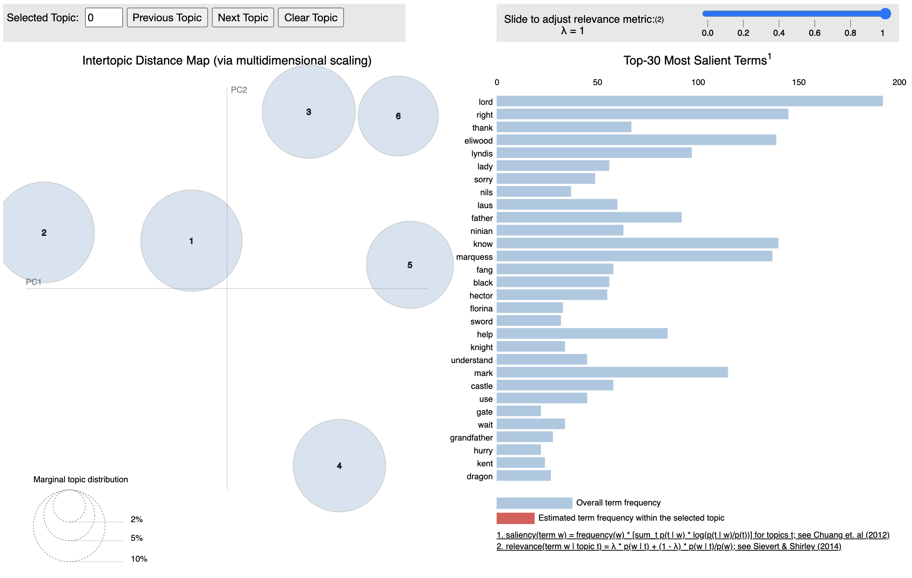

# What is Fire Emblem About, Anyway?
## Background
Fire Emblem is a Japanese video game series developed by Intelligent Systems, spanning 16 games over 30 years and selling over seven million copies. There are many polarizing opinions on Fire Emblem, but based on most of the discourse surrounding the game, one of the biggest pleasures of being a fan is complaining about the franchise's direction in nonspecific "recent years". The series is discontinuous, so characters often only exist in one or two games in the franchise. The "Fire Emblem" that supposedly might bind these games together, is not often of importance. By analyzing the scripts from each of the games, I hope to answer two questions: 1) What is Fire Emblem really about? 2) How have the topics of the games changed over time?

## MVP
The below is a visualization of the LDA generated with CountVectorizer for the script of Fire Emblem 7. The script has around 3600 lines of dialogue, though each "line" can vary from one or two words to full-blown paragraphs.

The above model seemed to fit better than the one generated by TF-IDF. The six topics fit well into plot arcs in the game:
1. Lord Eliwood trying to save Ninian
2. Assassination plot against Marquess Caelin
3. Lyn petitioning for help to reunite with her grandfather
4. Hector or Mark lending aid
5. Nils and Ninian trapped at the Dragon's Gate
6. Miscellaneous

I found it particularly interesting that topics 2 and 3 were separated by their tone -- "Lady Lyndis" and "marquess" with "black fang" and "assassins" in topic 2 and "Lyn" and "grandfather" with "help" in topic 3 -- distinguishing formal from casual conversations.

As expected, the titular Fire Emblem is not important enough to make an impact on the list of topics.

## Moving Ahead
The next step would be to apply the same method (making use of the extensive list of stop words uncovered from iterating on the process) to the remaining 15 games in the series. I will be comparing the relative weights on each topic, to see if there is a trend over the course of the series.
